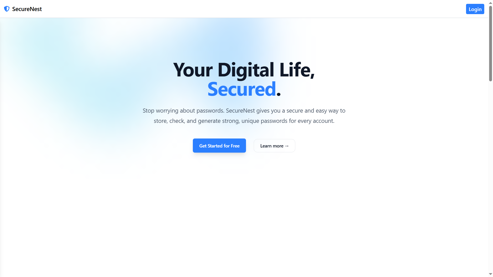

# 🚀 SecureNest

**SecureNest** is a full-stack, security-focused web application designed to help users prepare for job interviews through realistic, AI-driven mock sessions.
It includes advanced authentication, document protection with encryption, and password generation/checking tools — making it a complete platform for interview readiness and digital safety.

## 🌐 Live Demo

<a href='https:/securenest1.vercel.app/'> 
    
    </img>
</a>

---

## ✨ Features

🔐 **Advanced Authentication**  
Secure login system with OTP verification  
Token-based authentication (JWT)  
Full encryption for sensitive user data and documents  

🛡️ **Security Tools**  
Document protection with end-to-end encryption  
Password generator for creating strong, secure passwords  
Password checker to analyze strength and vulnerabilities  

---

## 💻 Tech Stack

**Framework:** Next.js  
**Styling:** Tailwind CSS  
**Database:** MongoDB  
**Cloud Service:** Cloudinary  
**Encryption:** Bcrypt & Crypto


---

## ⚙️ Installation

### 1. Clone the repository

```bash
git clone https://github.com/KaranSinghBhandari0/SecureNest.git
cd secureNest
npm install
npm run dev

```

⚙️ Environment Variables
---
To run this project, you will need to add the following environment variables to your .env files

```
MONGO_URL=your_mongodb_connection_string

JWT_SECRET=your_jwt_secret

CLOUD_NAME=your_cloudinary_cloud_name

API_KEY=your_cloudinary_api_key

API_SECRET=your_cloudinary_api_secret

MAIL_USER=your_email_address

MAIL_PASS=your_email_password

SECRET_KEY=your_crypto_Secret_Key